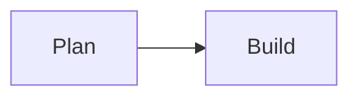

# Agent Log Mermaid Implementation Plan

> **For agentic workers:** REQUIRED SUB-SKILL: Use superpowers:subagent-driven-development (recommended) or superpowers:executing-plans to implement this plan task-by-task. Steps use checkbox (`- [ ]`) syntax for tracking.

**Goal:** Render Mermaid fenced code blocks as safe, readable diagrams in Agent Log Markdown.

**Architecture:** A focused React component dynamically loads and initializes Mermaid, renders one SVG per fenced block, and preserves the original source during loading or on failure. `AgentLogView` selects that component only for `language-mermaid`; existing Markdown rendering remains unchanged.

**Tech Stack:** React 19, TypeScript, react-markdown, Mermaid, Vitest, Testing Library, Playwright, CSS.

## Global Constraints

- Keep Mermaid at `securityLevel: "strict"` and `startOnLoad: false`.
- Do not enable raw HTML, diagram links, click callbacks, or loose security.
- Preserve non-Mermaid fenced and inline code behavior.
- Preserve diagram source while loading and after a render failure.
- Keep all diagram overflow inside the Agent Log pane.
- Use the existing Agent Log palette and typefaces.

---

### Task 1: Specify Mermaid fenced-block behavior

**Files:**
- Modify: `web/src/components/AgentLogView.test.tsx`
- Modify: `web/e2e/euphony.spec.ts`

**Interfaces:**
- Consumes: Markdown content in normalized `AgentLogEntry.content`.
- Produces: observable SVG output for a valid `mermaid` fence and a readable
  source fallback after a rejected render.

- [ ] **Step 1: Write failing React tests**

Mock only Mermaid's external rendering boundary. Render an agent message whose
content contains:

````markdown

````

Have the mock return:

```html
<svg role="img" aria-label="Plan to build diagram"></svg>
```

Assert that the diagram appears instead of a `language-mermaid` code element.
In a separate test, reject `render`, then assert the original `flowchart`
source and `Diagram could not be rendered.` remain visible. Keep an ordinary
`typescript` fence in the fixture and assert it stays a code block.

- [ ] **Step 2: Extend the real Playwright fixture**

Add a Mermaid fence with a small plan-to-build flowchart to the final fixture
entry in `claudeTranscriptLine`. In the existing live transcript scenario,
open Agent Log and assert `.agent-log-mermaid svg` is visible and its parent
uses horizontal overflow containment. Derive the fixture's Claude root from
`EUPHONY_E2E_PORT` with the same default and path pattern as
`web/playwright.config.ts`.

- [ ] **Step 3: Run tests and verify RED**

Run:

```bash
cd web
npm test -- --run src/components/AgentLogView.test.tsx
```

Expected: FAIL because Mermaid fences still render as ordinary `<pre><code>`.

### Task 2: Render diagrams with an isolated React component

**Files:**
- Create: `web/src/components/MermaidDiagram.tsx`
- Modify: `web/src/components/AgentLogView.tsx`
- Modify: `web/package.json`
- Modify: `web/package-lock.json`

**Interfaces:**
- Consumes: `MermaidDiagram({ source }: { source: string })`.
- Produces: one local diagram region containing generated SVG, or the original
  source plus an inline failure message.

- [ ] **Step 1: Add Mermaid**

Run:

```bash
cd web
npm install mermaid
```

- [ ] **Step 2: Implement the minimal component**

Create a module-level lazy loader that imports Mermaid, initializes it once
with the global constraints, and returns the module. In `MermaidDiagram`, use
`useId`, `useEffect`, and local state to call:

```ts
const { svg } = await mermaid.render(diagramId, source);
```

Ignore stale results in effect cleanup. Render the source in `<pre><code>`
while pending or failed, add `aria-busy` while pending, and show
`Diagram could not be rendered.` only after failure.

- [ ] **Step 3: Connect the Markdown renderer**

Add a `code` renderer to `markdownComponents`. When
`className === "language-mermaid"`, trim only the final newline injected by
Markdown and render `MermaidDiagram`. Forward all props unchanged for other
code.

- [ ] **Step 4: Run the focused test and verify GREEN**

Run:

```bash
cd web
npm test -- --run src/components/AgentLogView.test.tsx
```

Expected: all AgentLogView tests pass.

### Task 3: Integrate Mermaid with the Agent Log visual system

**Files:**
- Modify: `web/src/styles.css`

**Interfaces:**
- Consumes: `.agent-log-mermaid`, `.agent-log-mermaid-svg`,
  `.agent-log-mermaid-source`, and `.agent-log-mermaid-error`.
- Produces: a pane-contained dark diagram surface and legible fallback.

- [ ] **Step 1: Add scoped diagram styles**

Give `.agent-log-mermaid` full-width containment, a Raised black background,
Hairline border, restrained padding, and horizontal scrolling. Keep generated
SVG centered with a useful minimum width. Reuse existing code styles for the
fallback and use muted text for the local error.

- [ ] **Step 2: Run component tests and typecheck**

Run:

```bash
cd web
npm test -- --run src/components/AgentLogView.test.tsx
npm run typecheck
```

Expected: both commands exit successfully.

### Task 4: Verify the real browser integration

**Files:**
- Verify: `web/e2e/euphony.spec.ts`

**Interfaces:**
- Consumes: the production build, isolated in-memory database, isolated Claude
  transcript root, and real Mermaid runtime.
- Produces: browser evidence that a transcript fence becomes a contained SVG.

- [ ] **Step 1: Run the focused Playwright scenario**

Run:

```bash
cd web
EUPHONY_E2E_PORT=18140 npm run e2e -- --grep "shows a live agent transcript"
```

Expected: PASS with a real `.agent-log-mermaid svg` visible.

- [ ] **Step 2: Inspect the screenshot**

Open the generated `agent-log-tab.png` and verify that the diagram is legible,
does not widen the workspace, and fits the existing Agent Log hierarchy.

- [ ] **Step 3: Run full verification**

Run:

```bash
cd web
npm test -- --run
npm run typecheck
npm run build
cd ..
go test ./...
```

Expected: every command exits successfully with zero test failures.

- [ ] **Step 4: Commit**

```bash
git add docs/superpowers/specs/2026-07-30-agent-log-mermaid-design.md \
  docs/superpowers/plans/2026-07-30-agent-log-mermaid.md \
  web/package.json web/package-lock.json \
  web/src/components/MermaidDiagram.tsx \
  web/src/components/AgentLogView.tsx \
  web/src/components/AgentLogView.test.tsx \
  web/src/styles.css web/e2e/euphony.spec.ts
git commit -m "feat: render Mermaid diagrams in agent logs"
```
