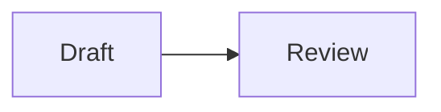

# Annotation Mermaid Implementation Plan

> **For agentic workers:** REQUIRED SUB-SKILL: Use superpowers:subagent-driven-development (recommended) or superpowers:executing-plans to implement this plan task-by-task. Steps use checkbox (`- [ ]`) syntax for tracking.

**Goal:** Render fenced `mermaid` code blocks as diagrams in Markdown documents opened by `euphony annotate`.

**Architecture:** `AnnotationView` detects the `language-mermaid` class exposed by `react-markdown` and delegates the source to the existing asynchronous `MermaidDiagram`. The shared component gains context-independent base classes plus an optional context class so Annotation and Agent Log share rendering behavior while keeping their own selectors.

**Tech Stack:** React 19, TypeScript, react-markdown, Mermaid 11, Vitest, Testing Library, Playwright, CSS.

## Global Constraints

- Keep Mermaid client-side and dynamically loaded.
- Continue using `securityLevel: "strict"` and `suppressErrorRendering: true`.
- Preserve ordinary fenced code blocks and inline code.
- Keep the original Mermaid source visible during loading and after failure.
- Do not enable Mermaid for HTML annotations.
- Use the existing Annotation document layout and palette.

---

### Task 1: Render Mermaid in Annotation Markdown

**Files:**
- Modify: `web/src/components/AnnotationView.test.tsx`
- Modify: `web/src/components/AnnotationView.tsx`
- Modify: `web/src/components/MermaidDiagram.tsx`
- Modify: `web/src/components/AgentLogView.tsx`
- Modify: `web/src/styles.css`

**Interfaces:**
- Consumes: `MermaidDiagram({ source, className? })`, where `source` is the fenced diagram text and `className` identifies its rendering context.
- Produces: a `.markdown-mermaid.annotation-mermaid` figure containing Mermaid SVG in Annotation Markdown; `.markdown-mermaid.agent-log-mermaid` remains available in Agent Log.

- [ ] **Step 1: Write the failing Annotation React test**

Add a Mermaid module double whose `render` method returns a literal SVG, then render this fixture:

````typescript
{
  ...markdownAnnotation,
  content: [
    "# Diagram",
    "",
    "```mermaid",
    "flowchart LR",
    "  Draft --> Review",
    "```",
  ].join("\n"),
}
````

Wait for `screen.getByRole("figure", { name: "Mermaid diagram" })`, assert it
has the `annotation-mermaid` class, assert its `svg` is visible, and assert
`code.language-mermaid` is absent. This test catches removal of the Annotation
Markdown component override or routing the fence through the ordinary code
renderer.

- [ ] **Step 2: Run the focused test and verify RED**

Run:

```bash
npm test -- --run src/components/AnnotationView.test.tsx
```

Expected: FAIL because the Annotation document still contains
`code.language-mermaid` and no figure named `Mermaid diagram`.

- [ ] **Step 3: Add the minimal Markdown component override**

In `AnnotationView.tsx`, import `isValidElement`, the React node type,
`Components` from `react-markdown`, and `MermaidDiagram`. Define a
`markdownComponents.pre` renderer that:

```tsx
const code = Array.isArray(children) ? children[0] : children;
if (
  isValidElement<{ className?: string; children?: ReactNode }>(code) &&
  code.props.className === "language-mermaid"
) {
  return (
    <MermaidDiagram
      className="annotation-mermaid"
      source={String(code.props.children).replace(/\n$/, "")}
    />
  );
}
return <pre {...props}>{children}</pre>;
```

Pass `components={markdownComponents}` only to the Markdown Annotation
`ReactMarkdown`.

- [ ] **Step 4: Make Mermaid styling context-independent**

Extend `MermaidDiagram` with optional `className?: string`. Give both rendered
and fallback figures the base class `markdown-mermaid` plus the optional
context class. Rename source and error descendant classes to
`markdown-mermaid-source` and `markdown-mermaid-error`. Pass
`className="agent-log-mermaid"` from `AgentLogView`.

Move the shared container, SVG, source, and error selectors in `styles.css`
from `.agent-log-mermaid` to `.markdown-mermaid`. Keep
`.agent-log-mermaid` and `.annotation-mermaid` as context hooks rather than
duplicating the visual rules. Use a fixed shared monospace error size so the
Annotation rendering does not depend on `--agent-log-font-size`.

- [ ] **Step 5: Run focused and related tests and verify GREEN**

Run:

```bash
npm test -- --run src/components/AnnotationView.test.tsx src/components/AgentLogView.test.tsx
```

Expected: both test files PASS, including the new Annotation SVG assertion and
the existing Agent Log fallback tests.

- [ ] **Step 6: Commit the React behavior**

```bash
git add web/src/components/AnnotationView.test.tsx \
  web/src/components/AnnotationView.tsx \
  web/src/components/MermaidDiagram.tsx \
  web/src/components/AgentLogView.tsx \
  web/src/styles.css
git commit -m "feat(web): render Mermaid in annotations"
```

### Task 2: Verify the Real Annotation Workflow

**Files:**
- Modify: `web/e2e/automation.spec.ts`

**Interfaces:**
- Consumes: the built `euphony annotate FILE` CLI workflow and
  `.annotation-mermaid svg`.
- Produces: browser-level evidence that a Markdown file passed through the CLI,
  API, event stream, Annotation tab, and real Mermaid runtime becomes an SVG.

- [ ] **Step 1: Extend the annotation CLI fixture**

Change the Markdown fixture written by the existing
`reviews annotations from the blocking CLI over Unix and TCP` scenario to:

````markdown
# Release proposal



Select this passage for feedback.
````

After the heading assertion, add:

```typescript
await expect(
  page.locator(".annotation-document .annotation-mermaid svg"),
).toBeVisible();
```

- [ ] **Step 2: Run static and unit verification**

Run:

```bash
npm test -- --run
npm run typecheck
npm run build
```

Expected: all Vitest files PASS; typecheck and production build exit 0.

- [ ] **Step 3: Run the Go suite**

Run:

```bash
go test ./...
```

Expected: all packages PASS.

- [ ] **Step 4: Run the focused Playwright scenario**

Use the repository's isolated E2E server and database conventions, then run:

```bash
npx playwright test e2e/automation.spec.ts --grep "reviews annotations"
```

Expected: PASS with the real Mermaid SVG visible before comments are submitted.

- [ ] **Step 5: Commit the browser regression**

```bash
git add web/e2e/automation.spec.ts
git commit -m "test(web): cover Mermaid annotation workflow"
```

### Task 3: Integrate the Verified Branch

**Files:**
- Verify: all files changed by Tasks 1 and 2

**Interfaces:**
- Consumes: verified commits on `codex/annotation-mermaid`.
- Produces: the same commits merged into the base branch without disturbing
  unrelated working-tree changes.

- [ ] **Step 1: Review the final diff and repository state**

Run:

```bash
git status --short
git diff --check HEAD^
git log --oneline --decorate -5
```

Expected: no uncommitted files, no whitespace errors, and the design,
implementation, and browser regression commits at the branch tip.

- [ ] **Step 2: Re-run focused completion verification**

Run:

```bash
npm test -- --run src/components/AnnotationView.test.tsx src/components/AgentLogView.test.tsx
npm run typecheck
go test ./...
```

Expected: every command exits 0 with no failed tests.

- [ ] **Step 3: Merge into the base branch**

From the base checkout, preserve all unrelated user changes and run:

```bash
git merge --no-ff codex/annotation-mermaid -m "Merge branch 'codex/annotation-mermaid'"
```

Expected: merge succeeds without overwriting unrelated working-tree changes.
